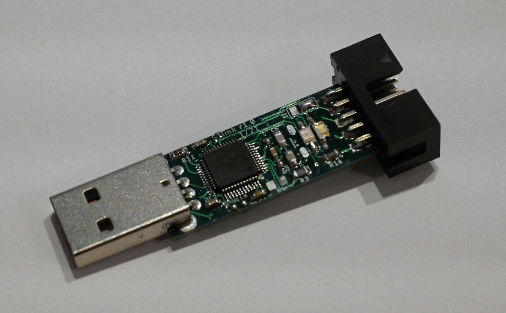

# ST-Link V2.1 USB dongle
This is an ST-Link V2.1 in the form of an USB dongle, similar to those available from any Chinese store. However, the IDC connector has different pinout, with the following pins available:
- +5 V and +3.3 V, each up to 500 mA
- TPWR for measuring target voltage or future optoisolators
- GND
- SSWCLK, SWDIO, NRST for programming/debugging
- SWO for SW Trace functionality
- RX/TX for VCP (Virtual Com Port)

